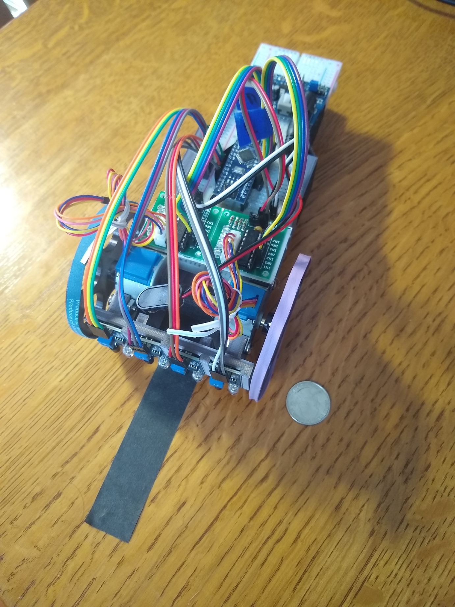

# MazeRobot
Arduino Code for a maze-solving robot. Designed for a maze constructed of lines rather than walls. I haven't really implemented any sort of "exit" signal to distinguish a dead-end from the goal, so right now it just maps the entire maze.

The robot code is located in the MapMaze folder, while MazeRepresentationCPP is for testing out abstract maze code and is largely not commented/cleaned up.

## Physical Construction
The parts list for this project were as follows:
 * Arduino controller board (I used a nano)
 * 2x 28BYJ-48 Stepper motor + ULN2003 driver board
 * 4x IR switches (should be tunable to near distances)
 * Breadboard power supply and 9v battery
 * Robot body (3d printed)
 * 2x robot wheels (3d printed) with rubber band tires for traction
 * Various breadboard jumpers, hot glue, tape, etc
 * Some legos hotglued on the back of the robot to reduce skid friction

Some pictures of the robot:

## Physical Justification and Limitations
I chose to use this type of robot because it has the minimum necessary elements for traversing a maze. I used steppers because of the fine position control possible with them, enabling me to do some odometry without any additional sensors and parts. Additionally, steppers have high torque at low speeds, which is also useful in this situation. I chose the type of sensor because IR switches are cheap and simple, and get the job done. 

However, the robot body design I used introduced some drawbacks. When executing a turn, the length of the robot means resistance on the back turns into a pretty high torque that can stop the robot. This especially sucks because (1) The majority of the length of the breadboard isn't used and (2) turning is one of the spots done without feedback in the code, so it's vulnerable to disturbance. My temporary solution was to hot glue a lego wheel and axle onto the back, but my next design for the robot (which I haven't implemented) includes a shorter breadboard and robot.

## Code Summary
I elected to use [Treumax's Algorithm](https://en.wikipedia.org/wiki/Maze_solving_algorithm#Tr%C3%A9maux's_algorithm) to map the maze. It's pretty easy and efficient to implement, and is guaranteed to map the entire maze. I use simple bang-bang line tracking in between intersections, and since the width of the tape is pretty much the same as the distance between sensors this leads to a pretty straight approach to each intersection. 

That leaves discovering which paths are available at each intersection. The leftmost and the rightmost sensor are never positioned above the line being followed, so if they are flipped at any point it can be deduced that there is a turn in that direction. To determine if there is a straight option, the robot proceeds past the intersection and checks if it is on a line (this is done blindly- introduces an opportunity for error). The robot then positions its center of rotation directly above the intersection and asks Treumax's algorithm which direction it should go, and makes that turn.

The maze is outputted to serial using line characters in the extended ascii range. Dead ends are marked with "v" pointing in the direction the robot must enter and leave from.

A incompletely explored maze and its completely explored end result:

## Code limitations
The multiple occurrences of blind traveling (turning, moving past intersection) can cause issues with robot performance. In addition, the type of maze it can perform is limited: using an array to represent the maze limits it to a grid like behavior, as you can see in the maze photos above. I have no plans on fixing either of these issues, partly because the issues with the blind travel can be fixed by increasing the length of the feedback travel part and doing output for a non-grid like maze is a pain.